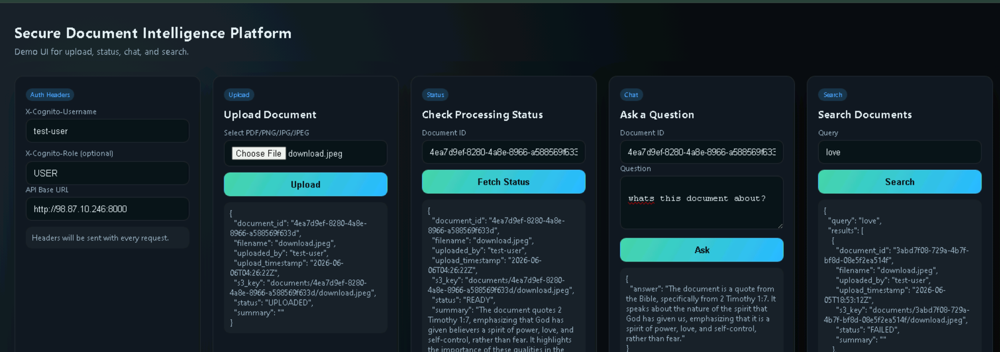

# Secure Document Intelligence Platform

This repository contains a FastAPI-based backend showcasing secure document ingestion, automated text extraction (OCR), LLM summarization and question-answering, and audit logging — all integrated with AWS managed services. The project is designed to run on EC2 or in containers and to be placed behind API Gateway with Cognito in production.


---

## Architecture Overview

- API Gateway (recommended) with Cognito User Pools authorizer — provides authentication and RBAC and forwards verified JWT claims to the backend as headers.
- FastAPI application (this repo) — handles upload, processing, chat, search, and audit endpoints.
- Amazon S3 — stores uploaded binary documents. Objects are encrypted at rest using Server-Side Encryption with AWS KMS (SSE‑KMS).
- Amazon Textract — extracts text from images and PDFs (synchronous for images, asynchronous jobs for PDFs).
- Amazon Bedrock — performs summarization and document-specific Q&A using LLMs.
- Amazon DynamoDB — stores document metadata, extracted text, summary, status, and audit logs.

Core runtime flow:
1. Client uploads a document (PDF/PNG/JPG/JPEG) to `POST /documents/upload`.
2. The app stores the file in S3 (SSE‑KMS) and writes a metadata record into DynamoDB (`status = UPLOADED`).
3. A background task reads the object, extracts text with Textract, stores `extracted_text` in DynamoDB, calls Bedrock to generate a `summary`, and sets `status = READY` (or `FAILED` if errors occur).
4. Chat requests (`POST /documents/{id}/chat`) load the extracted text, build a strict prompt that forbids hallucination, and call Bedrock to answer questions using the document content.
5. Audit events (upload, search, chat, delete, login) are written to an `audit` DynamoDB table.

---
# Application 



## AWS Integration & Security Details

### IAM / Execution Role

The app runs with AWS credentials provided by the environment (EC2 instance profile or container/task role). The role must be granted least-privilege permissions. At minimum, include:

- S3: `s3:PutObject`, `s3:GetObject`, `s3:DeleteObject` (restrict to the application bucket)
- DynamoDB: `GetItem`, `PutItem`, `UpdateItem`, `DeleteItem`, `Scan` (documents + audit tables)
- Textract: `DetectDocumentText`, `StartDocumentTextDetection`, `GetDocumentTextDetection`
- Bedrock: `InvokeModel`
- KMS: `Encrypt`, `Decrypt`, `GenerateDataKey` for the CMK used with S3 SSE‑KMS

Attach the role as an instance profile for EC2, or as a task execution role in ECS/Fargate. Do not embed long-lived keys in code.

### S3 Encryption (SSE‑KMS)

Use Server-Side Encryption with AWS KMS (SSE‑KMS) so S3 automatically encrypts objects at rest with a KMS customer-managed key (CMK) or AWS-managed key. This gives you tighter control and auditability.

Example CLI to enable default encryption with a CMK (replace `arn:aws:kms:...`):

```bash
aws s3api put-bucket-encryption \
  --bucket my-secure-bucket \
  --server-side-encryption-configuration '{"Rules":[{"ApplyServerSideEncryptionByDefault":{"SSEAlgorithm":"aws:kms","KMSMasterKeyID":"arn:aws:kms:REGION:ACCOUNT_ID:key/KEY_ID"}}]}'
```

Also ensure the service role has KMS permission scoped to that key ARN to use `GenerateDataKey` and `Decrypt` when needed. Use IAM key policies and KMS grants for robust access control.

### KMS Best Practices

- Prefer a customer-managed CMK for auditability, rotation, and fine-grained access control.
- Limit key usage to the service role and specific principals. Monitor KMS API calls with CloudTrail.
- For high-throughput scenarios, avoid calling KMS excessively; use data keys cached per process or short-term caching patterns.

### Textract

- Image files: synchronous API `DetectDocumentText` is used for quick scans.
- PDFs & multi-page documents: `StartDocumentTextDetection` (async job) + polling with `GetDocumentTextDetection` until completion; then collect LINE blocks.
- Textract and S3 should be in the same AWS Region. Ensure the role has S3 read access and the Textract permissions above.

### Bedrock (LLM)

- The app calls Bedrock's `InvokeModel` to request summaries and answers. The model ID is configurable via `BEDROCK_MODEL_ID`.
- Different models expect different payload shapes; the code supports both Amazon Nova and Anthropic-style message formats. See `app/services/bedrock_service.py`.
- The role needs `bedrock:InvokeModel` permission and your AWS account must have Bedrock access.

### API Gateway + Cognito

- In production, deploy API Gateway in front of the service and use a Cognito User Pool authorizer. API Gateway will validate JWTs and can map claims into headers for the backend.
- Recommended mapping (integration request / authorizer mapping):
  - `X-Cognito-Username` ← `cognito:username` (or `sub`)
  - `X-Cognito-Role` ← `custom:role` or `cognito:groups`

The application currently trusts these headers for identity and auditing (suitable for demos). For production, ensure the API is protected by the authorizer and consider also validating the JWT inside the app for defense-in-depth.

---

## Application Configuration (Environment Variables)

Set these environment variables for the app to run correctly:

- `AWS_REGION` — AWS region for clients (e.g., `us-east-1`)
- `S3_BUCKET_NAME` — S3 bucket used for documents
- `DYNAMODB_TABLE_NAME` — DynamoDB table for document metadata
- `AUDIT_TABLE_NAME` — DynamoDB table for audit records
- `BEDROCK_MODEL_ID` — Bedrock model identifier (e.g., `amazon.nova-2-lite-v1:0`)
- `COGNITO_USERNAME_HEADER` — header name (default `x-cognito-username`)
- `COGNITO_ROLE_HEADER` — header name (default `x-cognito-role`)

You can place these in a `.env` file for local testing, or inject them via the container/task definitions in production.

---

## Run & Test (Local)

1. Create and activate a Python virtual environment and install dependencies:

```bash
python -m venv .venv
source .venv/bin/activate
pip install -r requirements.txt
```

2. Export environment variables (example):

```bash
export AWS_REGION=us-east-1
export S3_BUCKET_NAME=your-bucket
export DYNAMODB_TABLE_NAME=documents-table
export AUDIT_TABLE_NAME=audit-table
export BEDROCK_MODEL_ID=amazon.nova-2-lite-v1:0
```

3. Start the app:

```bash
uvicorn app.main:app --host 0.0.0.0 --port 8000
```

4. Open the demo UI at `http://localhost:8000/ui`, set the `X-Cognito-Username` header in the UI and upload a PDF or image. Poll `GET /documents/{id}` until the `status` becomes `READY`, then `POST /documents/{id}/chat`.

## Docker (quick run)

```bash
docker build -t secure-docs-api .
docker run --rm -p 8000:8000 \
  -e AWS_REGION=us-east-1 \
  -e S3_BUCKET_NAME=your-bucket \
  -e DYNAMODB_TABLE_NAME=documents-table \
  -e AUDIT_TABLE_NAME=audit-table \
  -e BEDROCK_MODEL_ID=amazon.nova-2-lite-v1:0 \
  secure-docs-api
```

---

## Observability & Troubleshooting

- Logs: the app emits JSON-structured logs to stdout (configured in `app/config/logging.py`) which you can send to CloudWatch or a logging platform.
- Common errors:
  - `AccessDeniedException` from Textract or Bedrock → add the required IAM permissions to your role.
  - `ValidationException` from Bedrock → model expects a different payload shape; update `BEDROCK_MODEL_ID` or payload formatting in `app/services/bedrock_service.py`.
  - Textract timeouts for very large PDFs — increase polling limits or process in chunks.

## Data model & important code locations

- `app/api/documents.py` — upload endpoint, DynamoDB writes, and background processing (`_process_document`).
- `app/services/s3_service.py` — S3 file interactions.
- `app/services/textract_service.py` — Textract sync/async logic.
- `app/services/bedrock_service.py` — Bedrock request formatting and response handling.
- `app/services/dynamodb_service.py` — DynamoDB access patterns for documents & audit.
- `app/auth/dependencies.py` — demo header-based identity extraction.
- `app/static/index.html` — demo UI available at `/ui`.

